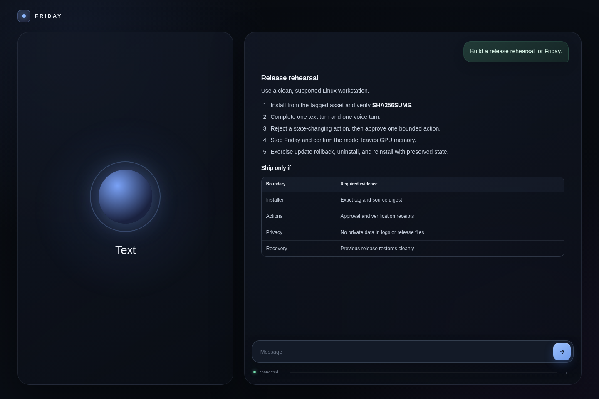

<p align="center">
  
</p>

<h1 align="center">Friday</h1>

<p align="center">
  <strong>A private voice and text assistant for one Linux workstation.</strong>
</p>

<p align="center">
  Local conversation, durable memory, and approved computer actions.<br>
  No hosted inference or telemetry is required for the core assistant.
</p>

<p align="center">
  <a href="docs/README.md">Documentation</a> ·
  <a href="docs/privacy.md">Privacy</a> ·
  <a href="SECURITY.md">Security</a> ·
  <a href="CONTRIBUTING.md">Contributing</a>
</p>

<p align="center">
  
</p>

<p align="center">
  <sub>The current interface, shown with a synthetic release-planning transcript.</sub>
</p>

> [!WARNING]
> Friday is a developer preview for a narrow Linux and NVIDIA setup. It has not
> received an independent security audit. Do not use it for safety-critical
> work.

Friday runs the conversation path on your workstation: microphone input,
transcription, Qwen inference, memory, and speech output. It can plan longer
tasks and use bounded file, process, browser, web, and desktop tools. Policy
checks, exact approvals, and post-action receipts sit between model output and
state-changing work.

The model can propose that something happened. Friday reports completion only
after the relevant executor records evidence.

## At a glance

| Boundary | Current implementation |
|---|---|
| Interface | Loopback HTTPS, text input, browser microphone, rich Markdown output |
| Language model | Local 27B Qwen3.8 derivative served through a pinned vLLM runtime |
| Speech | Parakeet ASR on CPU; Piper on CPU or OmniVoice on an eligible GPU |
| Memory | SQLite transcripts, tasks, corrections, preferences, reminders, and receipts |
| Actions | Typed tools with policy, resource admission, approval, execution, and verification |
| Exposure | Single trusted OS user; UI and model endpoints bound to loopback |
| Lifecycle | Transactional install, update, repair, rollback, stop, and uninstall |

## What works today

- Voice and text sessions with microphone echo suppression and a playback tail
  gate that prevents Friday from transcribing its own speech.
- Headings, lists, tables, links, inline code, and fenced code blocks in text
  responses.
- Durable plans and task steps that survive process restarts.
- Transcript correction, reminders, preferences, memories, and feedback tied to
  the task that produced an answer.
- Bounded file, process, public web, managed browser, document, and Hyprland
  desktop operations.
- Exact approval records for actions that cross a state or permission boundary.
- Independent receipts and reconciliation for effects whose first result is
  incomplete or uncertain.

User conversations, downloaded models, credentials, learned workflows, browser
profiles, and voice reference audio do not belong in the source repository.
The release checks reject them if they become tracked.

## Supported machine

The first public target is deliberately specific.

| Requirement | Support |
|---|---|
| Operating system | Linux x86_64 with a working systemd user session |
| GPU | NVIDIA CUDA GPU with at least 22 GiB VRAM |
| Disk | About 50 GiB free for the default runtime and model assets |
| Python | Python 3.12 in installer-owned virtual environments |
| Desktop actions | Hyprland in the current preview |
| Browser actions | A managed Chromium installation |
| Host tools | `bash`, `bwrap`, `curl`, `git`, `openssl`, `patch`, `tar`, `systemctl` |

The installer does not currently support macOS, Windows, containers, multi-user
hosts, or non-NVIDIA inference. Other Linux desktops may run the conversation
interface, but desktop automation is not supported outside Hyprland yet.

Friday selects the runtime profile from physical GPU identity and VRAM. A
single 22 to 28 GiB card keeps the long-context model on GPU and moves Piper to
CPU. Systems with more GPU headroom can keep OmniVoice on CUDA. VRAM from
unrelated cards is never combined automatically.

See [Runtime profiles](docs/runtime-profiles.md) for the complete placement and
resource-admission rules.

## Install a release

Download the versioned installer and its checksum file. The installer embeds
the exact source tag and source archive digest. It does not execute the mutable
`main` branch.

```bash
VERSION=v0.1.0-alpha.1
BASE="https://github.com/debpalash/friday/releases/download/$VERSION"
INSTALLER="friday-installer-$VERSION.sh"

mkdir -p /tmp/friday-install
curl -fL "$BASE/$INSTALLER" -o "/tmp/friday-install/$INSTALLER"
curl -fL "$BASE/SHA256SUMS" -o /tmp/friday-install/SHA256SUMS

(
  cd /tmp/friday-install
  sha256sum --check --ignore-missing SHA256SUMS
  bash "$INSTALLER"
)
```

The first install downloads the pinned Python environments, ASR and speech
assets, embedding model, vLLM runtime, and Qwen checkpoint. The installer runs
platform, hardware, disk, path, service, source, and asset checks before it
switches the active release.

For development from a trusted checkout:

```bash
git clone https://github.com/debpalash/friday.git
cd friday
./install.sh --local . --build-venv
```

Read the [installer contract](docs/installer.md) before changing the lifecycle
or directory layout.

## Daily commands

| Command | Result |
|---|---|
| `friday open` | Start Friday if needed, wait for readiness, then open the local app |
| `friday status` | Show the user service and resolved model runtime |
| `friday doctor` | Check hardware, assets, permissions, model identity, and health |
| `friday logs` | Follow the private user-service log |
| `friday update` | Install the configured upstream release through the same transaction |
| `friday repair` | Rebuild the active release and run its diagnostics |
| `friday stop` | Stop the service and unload the local model |
| `friday uninstall` | Remove the app and runtime while preserving personal data and models |

`friday uninstall --purge` also removes Friday-owned state, downloaded models,
skills, voices, browser data, and credentials. It prints the exact roots before
deleting them.

## How a request moves

```text
browser microphone or text
            |
            v
loopback HTTPS controller
            |
      ASR -> planner -> local Qwen -> response -> TTS
                |             |
                v             v
       policy and approval    SQLite graph and private state
                |
                v
       bounded executor -> receipt -> reconciliation
```

`supervisor.py` owns the model process, listener identity, health probes, and
runtime profile. `server.py` owns the controller, speech pipeline, planner,
approvals, tools, and embedded interface. SQLite is authoritative for durable
task state.

State-changing work follows a typed tool contract, resource admission, policy,
an exact approval when required, a bounded executor, and an independent receipt
or postcondition check. An HTTP success alone is not proof that a computer
action succeeded.

The full boundary model and current architectural debt are documented in
[Architecture](docs/architecture.md).

## Privacy and network access

The core conversation path stays local. Installation and explicitly requested
network tools still contact external services.

| Activity | Network behavior |
|---|---|
| Conversation, ASR, Qwen inference, TTS, memory | Local by default |
| Installation and update | Downloads pinned code, packages, and model assets |
| Search, news, page reading, managed browser | Connects when the user requests the capability |
| Remote reasoning | Disabled unless configured and approved |
| Telemetry | No telemetry or analytics sender is implemented |

The installer binds the interface to `127.0.0.1:8500`. Browser controllers use
a short-lived pairing challenge and keep their signing key in browser storage.
Do not expose Friday to a LAN or public interface without a separate deployment
review.

Raw microphone samples remain in memory for up to ten minutes so a transcript
can be corrected. Friday writes audio only after a correction, encrypts it with
desktop-keyring material, and exposes a separate deletion operation. Text
transcripts and task history persist in SQLite until removed or purged.

Read [Privacy and data retention](docs/privacy.md) for storage paths, retention,
runtime network tools, and current deletion limits.

## Repository map

| Path | Responsibility |
|---|---|
| `server.py` | HTTPS API, WebSocket session, orchestration, and embedded client |
| `supervisor.py` | Qwen/vLLM lifecycle, runtime profile, identity, and readiness |
| `friday_core/` | Tasks, policy, memory, speech, tools, processes, evidence, and evals |
| `ops/` | Asset installers, diagnostics, service templates, and runtime provisioning |
| `scripts/` | Release, secret-scan, screenshot, and uninstall tooling |
| `requirements/` | Hash-required application and Qwen dependency locks |
| `tests/` | Unit, integration, restart, policy, installer, and boundary tests |
| `docs/` | Architecture, privacy, runtime, installer, and release contracts |

## Project status

Friday is preparing its first alpha release. The current scope assumes one
trusted local OS user and one workstation. It is not a multi-tenant service, a
remote administration plane, or a safety authority.

Known release constraints include the large coupled `server.py` surface, a
narrow hardware matrix, and no independent penetration test. Private export and
offline selective deletion cover the durable graph and its projections. Alpha
schemas and extension APIs do not have a published compatibility window yet.

For setup and design questions, use GitHub Discussions. File reproducible bugs
through Issues with synthetic data and redacted logs. Report vulnerabilities
through the private route in [SECURITY.md](SECURITY.md).

## Documentation

- [Documentation index](docs/README.md)
- [Architecture and trust boundaries](docs/architecture.md)
- [Installer and rollback contract](docs/installer.md)
- [Runtime profiles and resource admission](docs/runtime-profiles.md)
- [Privacy and data retention](docs/privacy.md)
- [ASR model and asset verification](docs/asr.md)
- [Third-party licenses and model provenance](THIRD_PARTY.md)
- [Contributing](CONTRIBUTING.md)
- [Release process](docs/releasing.md)
- [Roadmap closure ledger](docs/roadmap-closure.md)
