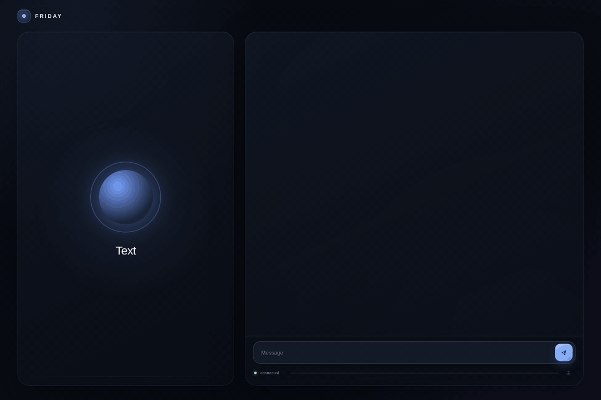

<p align="center">
  
</p>

<h1 align="center">Friday</h1>

<p align="center">
  <strong>A private voice and text assistant for one Linux workstation.</strong>
</p>

<p align="center">
  Local conversation, durable memory, and approved computer actions.<br>
  No hosted inference or telemetry is required for the core assistant.
</p>

<p align="center">
  <a href="docs/README.md">Documentation</a> ·
  <a href="docs/privacy.md">Privacy</a> ·
  <a href="SECURITY.md">Security</a> ·
  <a href="CONTRIBUTING.md">Contributing</a>
</p>

<p align="center">
  
</p>

<p align="center">
  <sub>The current interface, shown with a synthetic release-planning transcript.</sub>
</p>

> [!WARNING]
> Friday is a developer preview for a narrow Linux and NVIDIA setup. It has not
> received an independent security audit. Do not use it for safety-critical
> work.

Friday runs the conversation path on your workstation: microphone input,
transcription, Qwen inference, memory, and speech output. It can plan longer
tasks and use bounded file, process, browser, web, and desktop tools. Policy
checks, exact approvals, and post-action receipts sit between model output and
state-changing work.

The model can propose that something happened. Friday reports completion only
after the relevant executor records evidence.

## Guided tour

<p align="center">
  
</p>

<p align="center">
  <sub>Thirty seconds of everyday use, rendered from the shipped interface with
  scripted synthetic turns. No real conversation, model output, or personal
  data appears in it.</sub>
</p>

The tour shows, in order:

1. **A reminder.** "Remind me to call the dentist tomorrow at 9." becomes a
   durable reminder that fires in the app and on the desktop.
2. **The news.** "What's in the news this morning?" fetches headlines only
   because you asked, and renders them as links you open yourself.
3. **An approved desktop change.** "Switch the theme to Tokyo Night and turn
   on night light." stops at an exact approval card, applies both settings
   through Omarchy, and reports done only after a status receipt confirms it.
4. **A document.** "Read ~/Documents/lease.pdf and list the dates I need to
   remember." reads the file inside a granted path and answers with a table.
5. **A voice turn.** "Friday, what's using my GPU right now?" is heard,
   inspected, answered, and spoken.

### Everyday tasks

| Say or type | What happens | Boundary that applies |
|---|---|---|
| "Remind me to submit the report Friday at 4." | A reminder is stored in SQLite and delivered by the reminder daemon | Local write, no approval needed |
| "Remember that I prefer metric units." | A preference is saved and applied to later answers | Local memory you can list, correct, or delete |
| "What did we decide about the lease last week?" | Friday recalls the relevant transcript and task history | Reads only your local graph |
| "Read https://example.org/post and give me the three main claims." | The page is fetched through the bounded web reader and summarized | Network access only for the URL you gave |
| "Find where the retry logic lives in ~/projects/api." | The project is searched inside a granted path and matches are cited | Path grants you control |
| "Open a terminal in my project." | An allow-listed process spec is launched and its identity recorded | Process specs, not free-form shell |
| "Lock the screen." | The session is locked through Omarchy after an exact approval | Approval, then a lock receipt |
| "Undo that file change." | The last Friday write is rolled back from its recorded receipt | Rollback needs the original receipt |

Every state-changing row records an approval when a boundary is crossed and a
receipt after the executor runs. The model's own text is never taken as proof
that an effect happened.

## At a glance

| Boundary | Current implementation |
|---|---|
| Interface | Loopback HTTPS, text input, browser microphone, rich Markdown output |
| Language model | Local 27B Qwen3.8 derivative served through a pinned vLLM runtime |
| Speech | Parakeet ASR on CPU; Piper on CPU or OmniVoice on an eligible GPU |
| Memory | SQLite transcripts, tasks, corrections, preferences, reminders, and receipts |
| Actions | Typed tools for files, processes, Hyprland, Omarchy, browser, and public web |
| Exposure | Single trusted OS user; UI and model endpoints bound to loopback |
| Lifecycle | Transactional install, update, repair, rollback, stop, and uninstall |

## What works today

- Voice commands require `Friday, <request>` in the same utterance. Audio that
  is not addressed to Friday is discarded before the journal and model.
- Browser voice isolation, low-level audio rejection, and a 1.5-second playback
  tail keep background noise and Friday's own speech out of the command path.
- Headings, lists, tables, links, inline code, and fenced code blocks in text
  responses.
- Durable plans and task steps that survive process restarts.
- Transcript correction, reminders, preferences, memories, and feedback tied to
  the task that produced an answer.
- Bounded file, process, public web, managed browser, document, and Hyprland
  desktop operations.
- Omarchy-native inspection and approved controls for themes, fonts, night
  light, idle policy, brightness, screenshots, session lock, and the stock
  Firefox installer.
- Exact approval records for actions that cross a state or permission boundary.
- Independent receipts and reconciliation for effects whose first result is
  incomplete or uncertain.

User conversations, downloaded models, credentials, learned workflows, browser
profiles, and voice reference audio do not belong in the source repository.
The release checks reject them if they become tracked.

## Supported machine

The first public target is deliberately specific.

| Requirement | Support |
|---|---|
| Operating system | Linux x86_64 with a working systemd user session |
| GPU | NVIDIA CUDA GPU with at least 22 GiB VRAM |
| Disk | About 50 GiB free for the default runtime and model assets |
| Python | Python 3.12 in installer-owned virtual environments |
| Desktop actions | Hyprland in the current preview |
| Browser actions | A managed Chromium installation |
| Host tools | `bash`, `bwrap`, `curl`, `git`, `openssl`, `patch`, `tar`, `systemctl` |

The installer does not currently support macOS, native Windows, containers,
multi-user hosts, or non-NVIDIA inference. WSL 2 is reachable through the
Windows bootstrap but is unqualified. Other Linux desktops may run the conversation
interface, but desktop automation is not supported outside Hyprland yet.

Friday selects the runtime profile from physical GPU identity and VRAM. A
single 22 to 28 GiB card keeps the long-context model on GPU and moves Piper to
CPU. Systems with more GPU headroom can keep OmniVoice on CUDA. VRAM from
unrelated cards is never combined automatically.

See [Runtime profiles](docs/runtime-profiles.md) for the complete placement and
resource-admission rules.

## Install a release

One command on Linux:

```bash
curl -fsSL https://friday.palash.dev/install | bash
```

From Windows PowerShell, into an existing WSL 2 distribution:

```powershell
irm https://friday.palash.dev/install.ps1 | iex
```

The bootstrap resolves the newest published release, downloads that release's
versioned installer and `SHA256SUMS` from GitHub Releases, verifies the
checksum, and only then runs the installer. Set `FRIDAY_VERSION=v0.1.0-alpha.1`
to pin a release. Pass installer flags after `bash -s --`. WSL 2 is not a
qualified target: the Windows script hands off to Linux, where the installer's
platform, systemd, GPU, and disk checks decide.

To verify by hand instead, download the versioned installer and its checksum
file. The installer embeds the exact source tag and source archive digest. It
does not execute the mutable `main` branch.

```bash
VERSION=v0.1.0-alpha.1
BASE="https://github.com/debpalash/friday/releases/download/$VERSION"
INSTALLER="friday-installer-$VERSION.sh"

mkdir -p /tmp/friday-install
curl -fL "$BASE/$INSTALLER" -o "/tmp/friday-install/$INSTALLER"
curl -fL "$BASE/SHA256SUMS" -o /tmp/friday-install/SHA256SUMS

(
  cd /tmp/friday-install
  sha256sum --check --ignore-missing SHA256SUMS
  bash "$INSTALLER"
)
```

The first install downloads the pinned Python environments, ASR and speech
assets, embedding model, vLLM runtime, and Qwen checkpoint. The installer runs
platform, hardware, disk, path, service, source, and asset checks before it
switches the active release.

For development from a trusted checkout:

```bash
git clone https://github.com/debpalash/friday.git
cd friday
./install.sh --local . --build-venv
```

Read the [installer contract](docs/installer.md) before changing the lifecycle
or directory layout.

## Daily commands

| Command | Result |
|---|---|
| `friday open` | Start Friday if needed, wait for readiness, then open the local app |
| `friday status` | Show the user service and resolved model runtime |
| `friday doctor` | Check hardware, assets, permissions, model identity, and health |
| `friday logs` | Follow the private user-service log |
| `friday update` | Install the configured upstream release through the same transaction |
| `friday repair` | Rebuild the active release and run its diagnostics |
| `friday stop` | Stop the service and unload the local model |
| `friday uninstall` | Remove the app and runtime while preserving personal data and models |

`friday uninstall --purge` also removes Friday-owned state, downloaded models,
skills, voices, browser data, and credentials. It prints the exact roots before
deleting them.

## How a request moves

```text
browser microphone or text
            |
            v
loopback HTTPS interface
            |
 VAD -> ASR -> address gate -> planner -> local Qwen -> response -> TTS
                           |             |
                           v             v
                  policy and approval    SQLite graph and private state
                           |
                           v
                  bounded executor -> receipt -> reconciliation
```

`supervisor.py` owns the model process, listener identity, health probes, and
runtime profile. `server.py` composes explicit local transport, conversation,
voice-session, task, speech, and external frontend boundaries.
SQLite is authoritative for durable task state.

State-changing work follows a typed tool contract, resource admission, policy,
an exact approval when required, a bounded executor, and an independent receipt
or postcondition check. An HTTP success alone is not proof that a computer
action succeeded.

The full boundary model and current architectural debt are documented in
[Architecture](docs/architecture.md).

## Privacy and network access

The core conversation path stays local. Installation and explicitly requested
network tools still contact external services.

| Activity | Network behavior |
|---|---|
| Conversation, ASR, Qwen inference, TTS, memory | Local by default |
| Installation and update | Downloads pinned code, packages, and model assets |
| Search, news, page reading, managed browser | Connects when the user requests the capability |
| Remote reasoning | Disabled unless configured and approved |
| Telemetry | No telemetry or analytics sender is implemented |

The installer binds the interface to `127.0.0.1:8500`. The local browser opens
without an application token or account. Friday rejects non-loopback bind hosts,
foreign Host headers, and foreign browser origins. Any process running as the
same OS user can still reach the local API, so the operating-system account is
the security boundary. Friday does not support direct LAN or public exposure.

Live microphone samples exist in memory only while VAD and ASR evaluate the
current utterance. Unaddressed audio is then discarded. Samples from admitted
commands remain in memory for up to ten minutes so a transcript can be
corrected. Friday writes audio only after a correction, encrypts it with
desktop-keyring material, and exposes a separate deletion operation. Text
transcripts and task history persist in SQLite until removed or purged.

Read [Privacy and data retention](docs/privacy.md) for storage paths, retention,
runtime network tools, and current deletion limits.

## Repository map

| Path | Responsibility |
|---|---|
| `server.py` | FastAPI composition root and WebSocket request lifecycle |
| `frontend/` | Static local interface, released independently from Python composition |
| `supervisor.py` | Qwen/vLLM lifecycle, runtime profile, identity, and readiness |
| `friday_core/` | Tasks, policy, memory, speech, tools, Omarchy, processes, evidence, and evals |
| `ops/` | Asset installers, diagnostics, service templates, and runtime provisioning |
| `scripts/` | Release, secret-scan, repository and site configuration, screenshot, tour, and uninstall tooling |
| `site/` | Astro source for [friday.palash.dev](https://friday.palash.dev) and the install bootstraps |
| `requirements/` | Hash-required application and Qwen dependency locks |
| `tests/` | Unit, integration, restart, policy, installer, and boundary tests |
| `docs/` | Architecture, privacy, runtime, installer, and release contracts |

## Project status

Friday is preparing its first alpha release. The current scope assumes one
trusted local OS user and one workstation. It is not a multi-tenant service, a
remote administration plane, or a safety authority.

Known release constraints include a narrow hardware matrix and no independent
penetration test. Private export and offline selective deletion cover the
durable graph and its projections. Durable data and authority follow the
[alpha compatibility policy](docs/compatibility.md); experimental extension
APIs intentionally have no compatibility window yet.

For setup and design questions, use GitHub Discussions. File reproducible bugs
through Issues with synthetic data and redacted logs. Report vulnerabilities
through the private route in [SECURITY.md](SECURITY.md).

## Documentation

- [Documentation index](docs/README.md)
- [Architecture and trust boundaries](docs/architecture.md)
- [Alpha compatibility policy](docs/compatibility.md)
- [Threat model and incident boundaries](docs/threat-model.md)
- [Installer and rollback contract](docs/installer.md)
- [Runtime profiles and resource admission](docs/runtime-profiles.md)
- [Privacy and data retention](docs/privacy.md)
- [ASR model and asset verification](docs/asr.md)
- [Third-party licenses and model provenance](THIRD_PARTY.md)
- [Contributing](CONTRIBUTING.md)
- [Release process](docs/releasing.md)
- [Roadmap closure ledger](docs/roadmap-closure.md)

## License

Friday is released under the [Apache License 2.0](LICENSE). Downloaded models
and runtimes keep their own licenses, including the GPL-3.0-or-later Piper
speech runtime. See [THIRD_PARTY.md](THIRD_PARTY.md) for the inventory.
