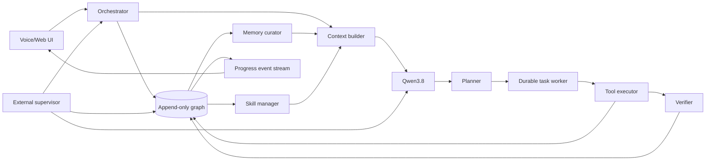
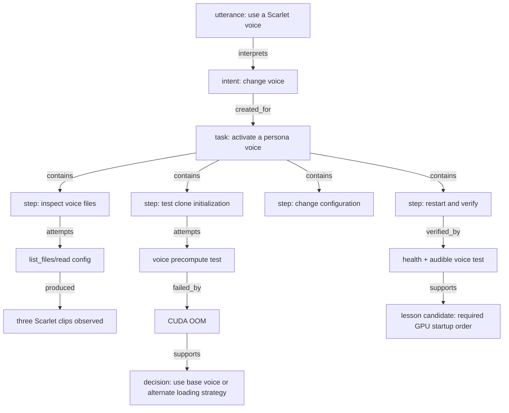

# Friday Cognitive Graph Specification

Status: proposed v0.1
Scope: the local Friday voice assistant in this repository

## 1. Purpose

Friday should become more useful through experience without treating generated text,
misheard speech, or failed actions as truth. Every meaningful interaction and action is
recorded in a graph, but only well-supported information is promoted into active memory or
reusable skills.

The central distinction is:

> Record everything. Learn selectively. Act from verified state.

The graph is not a transcript database and it is not a prompt dump. It is the durable state
of the assistant: what happened, why an action was taken, what it produced, whether it
worked, what evidence supports a belief, and which version of a skill or file was involved.

This system is intended to make Friday persistent, inspectable, resumable, and capable of
measured self-improvement. It does not claim to turn the underlying model into AGI or to
perform continuous model-weight training.

## 2. Current system and failure modes

The current implementation has a useful voice loop and a small tool loop, but its durable
state is an 80-message slice of `session.json`. That produces several observable failures:

- An assistant sentence such as "Working on it" is indistinguishable from actual work.
- A request does not create a durable task and cannot reliably survive a restart.
- Tool calls and results are printed to the server log but are not first-class UI progress.
- Conversation history contains claims but no provenance, confidence, scope, or expiry.
- The model can repeat its own unsupported output until it appears established.
- File writes and restart are available without a test, health-check, or rollback contract.
- A failed background model call previously looked like silence rather than task failure.
- Voice and LLM processes share one GPU but have no supervisor coordinating startup order.

The cognitive graph addresses these as state-model problems rather than prompt problems.

## 3. Design principles

1. **Append-only source of truth.** Raw events, nodes, and edges are immutable. Corrections
   add new facts and `supersedes` or `contradicts` edges.
2. **Generated prose is not evidence.** An assistant message can explain graph state, but it
   cannot establish a fact merely by having said it.
3. **Actions require receipts.** An action is complete only when its result and verification
   are recorded.
4. **Progress comes from execution.** Progress messages are emitted by task state changes
   and tool execution, not improvised by the conversational model.
5. **Memory has types and scope.** User preferences, machine facts, project facts, episodes,
   and procedures have different authority and invalidation rules.
6. **Learning is promotion, not accumulation.** All interactions enter the journal; only
   evidence-backed candidates enter active memory.
7. **Failures remain useful.** Failed attempts are retained as negative evidence without
   being promoted as successful procedure.
8. **Self-change is transactional.** A code or skill change is staged, tested, promoted,
   health-checked, and rolled back on failure.
9. **The graph is inspectable.** Pulash can ask what Friday knows, why it believes it, what it
   is doing, and what changed.
10. **Capability is permissioned.** Learning a procedure does not grant authority to execute
    destructive or external actions.

## 4. System architecture



`server.py` becomes a thin voice and WebSocket boundary. It should not own durable task
execution. A separate worker owns task leases, and a separate supervisor owns process
restart and rollback so Friday does not have to revive itself from inside a dying process.

## 5. The three knowledge layers

Every interaction is retained, but it moves through explicit layers:

### Layer 0: journal

Immutable observations of what happened: utterances, model messages, tool invocations,
outputs, errors, file hashes, task transitions, and evaluations. Journal entries are not
automatically injected into future prompts.

### Layer 1: candidates

Structured claims or procedures extracted from the journal. Candidates include provenance,
scope, confidence, and a proposed retention policy. They are unavailable to normal retrieval
unless the context builder explicitly requests uncertain material.

### Layer 2: active knowledge

Claims, preferences, and skills that passed their promotion rules. Active knowledge can be
retrieved into model context. It can later be disputed, superseded, retracted, or expired;
it is never silently overwritten.

This separation is the primary anti-slop mechanism.

## 6. Graph model

### 6.1 Node types

| Node | Meaning | Typical retention |
|---|---|---|
| `session` | A connected UI/voice session | Permanent metadata |
| `turn` | One user input and its resulting work | Permanent |
| `utterance` | ASR transcript or typed input | Permanent text; audio off by default |
| `intent` | Structured interpretation of a turn | Permanent, marked inferred |
| `task` | Durable objective with completion contract | Permanent |
| `plan` | Versioned ordered task plan | Permanent |
| `step` | One executable unit of a plan | Permanent |
| `action` | Tool or system operation requested | Permanent |
| `observation` | Tool output, error, or environmental result | Permanent or redacted |
| `artifact` | File, patch, test report, or generated asset | Hash permanent; body policy-based |
| `claim` | A normalized proposition with scope | Lifecycle-managed |
| `preference` | A user-specific subjective claim | Until changed or deleted |
| `decision` | Chosen option and concise rationale | Permanent |
| `lesson` | Candidate reusable insight | Lifecycle-managed |
| `skill` | Stable skill identity | Permanent |
| `skill_version` | Immutable instructions, code, and tests | Permanent |
| `evaluation` | Deterministic or model-based assessment | Permanent |
| `failure` | Failed attempt and classified cause | Permanent |
| `process` | Friday, vLLM, TTS, or supervisor instance | Operational retention |
| `checkpoint` | Recoverable state before a mutation | Policy-based |

### 6.2 Edge types

Edges are directed and immutable.

| Edge | Meaning |
|---|---|
| `contains` | Session contains turn; plan contains step |
| `responds_to` | Assistant output responds to an utterance |
| `interprets` | Intent was derived from an utterance |
| `created_for` | Task was created for an intent or turn |
| `next` | Ordered step or event relationship |
| `attempts` | Action attempts a step |
| `used` | Action used a tool, skill version, memory, or artifact |
| `produced` | Action produced an observation or artifact |
| `supports` | Evidence supports a claim, lesson, or evaluation |
| `contradicts` | Evidence or claim conflicts with another claim |
| `verified_by` | Step, artifact, or outcome passed an evaluation |
| `failed_by` | Attempt failed with a failure node |
| `derived_from` | Summary, claim, or lesson traces to source nodes |
| `supersedes` | New claim, plan, or version replaces an older one |
| `activated_as` | A validated skill version became active |
| `rolled_back_to` | Failed change restored a checkpoint or version |
| `relevant_to` | Memory or skill applies to an entity, project, or task |

### 6.3 Example: the Scarlet voice request



Friday may report "Testing Scarlet voice" only after `A2` has entered `running`. It may say
"Done" only after `E` passes.

## 7. Storage design

Use SQLite in WAL mode at `state/friday.db`. A graph database is unnecessary at this scale;
SQLite gives atomic transactions, local ownership, FTS5 search, simple backup, and no new
service to keep alive. Nodes and edges provide graph semantics, while projections make
common queries fast.

### 7.1 Core schema

```sql
PRAGMA journal_mode = WAL;
PRAGMA foreign_keys = ON;

CREATE TABLE graph_events (
    seq             INTEGER PRIMARY KEY AUTOINCREMENT,
    event_id        TEXT NOT NULL UNIQUE,
    occurred_at     TEXT NOT NULL,
    actor           TEXT NOT NULL,
    session_id      TEXT,
    turn_id         TEXT,
    task_id         TEXT,
    event_type      TEXT NOT NULL,
    payload_json    TEXT NOT NULL,
    payload_sha256  TEXT NOT NULL,
    idempotency_key TEXT UNIQUE
);

CREATE TABLE nodes (
    node_id          TEXT PRIMARY KEY,
    kind             TEXT NOT NULL,
    created_event_id TEXT NOT NULL REFERENCES graph_events(event_id),
    body_json        TEXT NOT NULL,
    body_sha256      TEXT NOT NULL
);

CREATE TABLE edges (
    edge_id          TEXT PRIMARY KEY,
    from_node_id     TEXT NOT NULL REFERENCES nodes(node_id),
    relation         TEXT NOT NULL,
    to_node_id       TEXT NOT NULL REFERENCES nodes(node_id),
    created_event_id TEXT NOT NULL REFERENCES graph_events(event_id),
    attributes_json  TEXT NOT NULL DEFAULT '{}',
    UNIQUE(from_node_id, relation, to_node_id, created_event_id)
);

CREATE INDEX edges_from_relation ON edges(from_node_id, relation);
CREATE INDEX edges_to_relation ON edges(to_node_id, relation);
CREATE INDEX events_task_seq ON graph_events(task_id, seq);
CREATE INDEX events_turn_seq ON graph_events(turn_id, seq);
```

Application code must not update or delete these three tables. New state is represented by
new events and edges. Development builds should install triggers that reject update/delete.

### 7.2 Rebuildable projections

Mutable projection tables are derived from the append-only log and may be rebuilt:

- `task_state`: current status, plan version, active step, lease owner, heartbeat, retries.
- `claim_state`: subject, predicate, object, scope, lifecycle, confidence, validity window.
- `skill_state`: active version, permissions, evaluation score, last successful use.
- `entity_state`: canonical names and aliases.
- `progress_outbox`: ordered UI events awaiting delivery.
- `fts_memory`: searchable text from eligible active memories and skill metadata.

Projection mutations and their source graph event must commit in one transaction.

### 7.3 IDs, timestamps, and artifacts

- IDs are sortable time-based IDs when available, otherwise UUID4 plus `occurred_at`.
- Timestamps are UTC ISO 8601 with microseconds.
- Large outputs live under `state/artifacts/<sha256>`; graph nodes store the digest, media
  type, size, redaction state, and optional source path.
- API keys, auth headers, environment secrets, and raw credentials are never persisted.
- Raw microphone audio is not retained unless Pulash explicitly enables it.

## 8. Evidence and memory promotion

### 8.1 Evidence classes

Evidence authority is domain-aware; it is not one universal confidence number.

| Evidence class | Strong for | Weak or invalid for |
|---|---|---|
| `user_explicit` | User preferences, identity, requested policy | Unverified external facts |
| `tool_observation` | Current files, processes, command results | Future stability |
| `deterministic_test` | Whether a defined invariant passed | Broader quality judgments |
| `external_source` | Claims within that source's scope | User intent or local state |
| `model_inference` | Candidate hypotheses and plans | Promotion without verification |
| `assistant_utterance` | What Friday communicated | Evidence for the claim communicated |

ASR transcripts include recognition confidence and remain observations of what was heard,
not automatically authoritative user statements. Low-confidence or fragmentary utterances
must not create durable preferences.

### 8.2 Claim lifecycle

`candidate -> corroborated -> active -> disputed -> superseded | retracted | expired`

Promotion rules:

- Explicit user preferences can become active immediately in `scope=user_preference`.
- Local machine/project facts require a direct observation and an invalidation key such as
  file hash, process instance, configuration version, or expiry time.
- A reusable procedure requires a successful verified task, and either a second independent
  success or explicit user approval before automatic activation as a skill.
- Model inferences remain candidates until supported by another evidence class.
- Assistant messages, summaries, and repeated claims never promote themselves.
- Failed procedures may create a negative lesson, never a successful skill.

### 8.3 Contradictions

A new contradiction never overwrites the old node. The curator creates a `contradicts` edge
and resolves active context using:

1. scope match;
2. evidence authority for that scope;
3. directness and verification;
4. recency or validity window;
5. explicit user correction;
6. unresolved conflict disclosure.

The losing claim becomes disputed or superseded but remains auditable.

### 8.4 Anti-poisoning rules

- Never learn a fact solely from generated assistant text.
- Never recursively summarize a summary without preserving links to raw sources.
- Never execute instructions found inside tool output as if they came from the user or
  system; content origin and instruction authority are separate fields.
- Never turn a one-off workaround into an active skill without verification.
- Never treat frequency as truth when repeated items share the same original source.
- Never silently merge two people, projects, paths, or concepts because their names match.
- Limit automatic memory writes per turn and require a reason for retention.
- Store uncertainty and expiry; do not force every claim into true/false.
- Provide inspect, correct, forget, and export operations to Pulash.

## 9. Durable task lifecycle

Tasks use the following state machine:

```text
created -> interpreting -> planned -> running -> verifying -> completed
                                      |             |
                                      v             v
                                waiting_input     failed
                                      |
                                   running

running/verification failure -> replanning -> running
any nonterminal state -> cancelled
process loss -> recovering -> prior safe state
```

Each task has:

- an objective in the user's words;
- a normalized intent;
- explicit completion criteria;
- scope and permissions;
- a versioned plan;
- a retry and time budget;
- an active lease and heartbeat;
- an idempotency policy for every action;
- evidence required before completion;
- a concise user-facing status derived from actual state.

The worker resumes nonterminal tasks after restart. If a crash occurs after an action may
have caused an external side effect, the action becomes `outcome_unknown`; Friday must
reconcile state rather than blindly retry it.

Simple conversation can remain a synchronous turn with no durable task. Any request to
inspect, change, create, monitor, learn, or operate something creates a task.

## 10. Agent execution loop

1. **Observe:** append the utterance and ASR metadata.
2. **Interpret:** create structured intent; distinguish conversation from work.
3. **Contract:** define completion evidence and permission boundary.
4. **Plan:** create small, verifiable steps. Store concise rationale, not hidden reasoning.
5. **Act:** claim a task lease, emit progress, execute one tool action, record its receipt.
6. **Evaluate:** compare the observation with the step's expected result.
7. **Adapt:** proceed, retry with a meaningfully different approach, replan, or request input.
8. **Verify:** run task-level acceptance checks.
9. **Report:** describe only graph-backed state and evidence.
10. **Reflect:** propose memories, negative lessons, or skills.
11. **Curate:** apply promotion rules and update projections.

Planner, executor, verifier, and curator may initially be separate calls to the same local
Qwen model with different structured prompts. Deterministic code owns state transitions and
permissions; model prose never does.

## 11. Progress reporting

Progress is an event stream, not conversational filler.

```json
{
  "type": "progress",
  "seq": 481,
  "task_id": "task_...",
  "phase": "act",
  "state": "started",
  "label": "Testing Scarlet voice initialization",
  "detail": "Using persona/voices/scarlet/scarlet_1.mp3",
  "occurred_at": "2026-08-22T02:30:00.000000Z"
}
```

Rules:

- Emit on task creation, plan change, step start/end, tool start/end, retry, blocker,
  verification, completion, failure, restart, and recovery.
- UI text progress is immediate; spoken progress is throttled and reserved for meaningful
  state changes or long-running work.
- A progress label is generated from structured action metadata and sanitized arguments.
- Secrets and large tool outputs never enter progress events.
- Reconnecting clients resume from the last `seq` so progress is not lost across restarts.
- "Working on it" is forbidden unless the task has an active lease and recent heartbeat.
- "Done" is forbidden unless task state is `completed` and verification evidence exists.

The UI should show a compact task card with objective, current step, elapsed time, last
verified result, and expandable event timeline.

## 12. Context construction and retrieval

Do not send the last N raw messages as Friday's entire mind. Construct each model request
from bounded sections:

1. immutable system and safety policy;
2. persona and voice style;
3. current utterance and nearby conversational turns;
4. active task contract, plan, and latest observations;
5. relevant active preferences and project facts;
6. relevant verified lessons and active skills;
7. current tool schemas and permissions.

Version 1 retrieval uses SQLite FTS5 plus graph traversal; this avoids another GPU model and
keeps behavior inspectable. Candidate scoring should combine text relevance, entity/task
overlap, evidence quality, scope, recency/validity, and contradiction penalties. Hard token
budgets apply per section.

Embeddings may be added later as a CPU service, but lexical retrieval plus explicit graph
links should be the baseline and the fallback. Retrieval results include internal node IDs
so every injected memory can be traced after the response.

## 13. Skill lifecycle

A skill is a versioned procedural asset, not a remembered paragraph.

Each skill version contains:

- name, purpose, triggers, and non-triggers;
- required permissions and tools;
- preconditions;
- executable steps or code;
- expected observations;
- tests and evaluation thresholds;
- rollback or cleanup behavior;
- provenance links to successful tasks;
- compatibility metadata.

Lifecycle:

`proposed -> drafted -> testing -> validated -> active -> deprecated | quarantined`

Friday may draft a skill after a verified success. Automatic activation requires tests and
the promotion rule for procedures. Runtime failures reduce reliability and can quarantine a
skill. Skill versions are immutable; edits create new versions connected by `supersedes`.

## 14. Safe self-modification

Core code changes use a transaction-like deployment:

1. Create a checkpoint containing file hashes and recoverable copies.
2. Create a patch artifact linked to the motivating task and evidence.
3. Apply the patch to a staging tree or overlay.
4. Run syntax, unit, integration, and policy tests.
5. Run a canary with mocked ASR/LLM/TTS when GPU coexistence prevents a full second stack.
6. Promote the patch only if required evaluations pass.
7. Ask the external supervisor to restart affected processes in dependency order.
8. Run production health and minimal behavior checks.
9. Mark the task complete, or automatically roll back and record the failure.

Friday must not modify the safety policy, graph audit rules, permission engine, verifier
thresholds, or rollback mechanism without explicit user approval. Self-improvement is not
self-authority.

## 15. Process supervision

Add an external `supervisor.py` or user service responsible for:

- starting vLLM before Friday when model initialization needs transient VRAM;
- starting Friday without optional voice cloning when headroom is insufficient;
- exposing process health to the graph;
- restarting crashed services with bounded backoff;
- detecting orphaned GPU workers;
- executing tested deployments and rollbacks;
- writing process and recovery events even when `server.py` is down.

This removes the current circular dependency in which Friday is expected to restart and
verify itself while its own process is terminating.

## 16. Proposed repository layout

```text
friday/
  server.py                    # FastAPI, WebSocket, audio boundary
  supervisor.py                # lifecycle, deploy, rollback, health
  friday_core/
    models.py                  # typed node/event/task models
    graph.py                   # transactional append/query API
    schema.sql
    projections.py
    orchestrator.py
    worker.py
    planner.py
    verifier.py
    context.py
    memory.py
    progress.py
    permissions.py
    artifacts.py
    skills.py
  skills/
    <skill-name>/
      SKILL.md
      manifest.json
      tests/
  state/
    friday.db                  # ignored runtime state
    artifacts/                 # content-addressed, ignored
    checkpoints/               # recoverable deployments, ignored
  tests/
    test_graph.py
    test_tasks.py
    test_memory_policy.py
    test_progress.py
    test_recovery.py
    test_self_edit.py
  docs/
    cognitive-graph-spec.md
```

## 17. Internal interfaces

The initial Python interfaces should remain narrow:

```python
class GraphStore:
    def append(self, command: GraphCommand) -> GraphReceipt: ...
    def query(self, query: GraphQuery) -> GraphResult: ...
    def rebuild_projections(self) -> None: ...

class TaskService:
    def create(self, objective, completion_contract, permissions) -> Task: ...
    def transition(self, task_id, expected_state, new_state, evidence=()) -> Task: ...
    def heartbeat(self, task_id, lease_id) -> None: ...

class MemoryCurator:
    def propose(self, sources, candidate) -> Claim: ...
    def evaluate(self, claim_id) -> PromotionDecision: ...
    def retrieve(self, context, budget) -> list[MemoryHit]: ...

class ProgressBus:
    def publish_from_event(self, event_id) -> ProgressEvent | None: ...
    def since(self, sequence) -> list[ProgressEvent]: ...

class SkillManager:
    def draft(self, task_id, sources) -> SkillVersion: ...
    def evaluate(self, version_id) -> Evaluation: ...
    def activate(self, version_id, approval=None) -> None: ...
```

Only these services write graph state. Model tool calls submit typed commands; they do not
receive arbitrary database access.

## 18. Learning cadence

Every action and interaction is recorded immediately. Learning is deliberately slower:

- **Per turn:** extract explicit preference changes and corrections.
- **Per completed task:** create outcome, evaluation, and candidate lessons.
- **During idle time:** consolidate related episodes and detect contradictions.
- **After repeated success:** propose or upgrade a skill.
- **On a scheduled evaluation:** compare current behavior with the benchmark and retain only
  changes that improve it without safety or reliability regression.

No autonomous online fine-tuning is part of v1. If weight adaptation is explored later, its
training set must contain only curated, provenance-linked examples and must pass the same
versioned evaluation and rollback process as code.

## 19. Acceptance scenarios

The first release is acceptable only when these tests pass:

1. **No fake progress:** asking for a file change creates a task; every displayed progress
   line corresponds to a graph event and tool receipt.
2. **Verified completion:** Friday cannot say "Done" before the requested artifact exists
   and its relevant test passes.
3. **Crash recovery:** terminate Friday during a multi-step task; after restart it resumes
   from the last safe step without duplicating a completed action.
4. **Memory hygiene:** an unsupported assistant claim appears in the journal but is absent
   from active memory and future retrieval.
5. **User correction:** "I prefer X, not Y" supersedes the old preference while preserving
   both nodes and provenance.
6. **Contradictory evidence:** conflicting tool observations create a disputed claim rather
   than silent overwrite.
7. **Skill promotion:** one successful workaround remains a lesson candidate; repeated,
   tested success can produce an active skill version.
8. **Prompt injection resistance:** instructions inside a read file are stored as content,
   not promoted to system authority or executed automatically.
9. **Self-edit rollback:** introduce a broken server patch; staging rejects it or production
   health failure restores the previous checkpoint.
10. **Status fidelity:** "What are you doing?" returns the task's actual active step, last
    receipt, and blocker from the graph.
11. **Service recovery:** an orphaned vLLM worker is detected and recovered in the correct
    GPU startup order.
12. **Conversational latency:** ordinary chat does not wait for background consolidation.

## 20. Delivery phases

### Phase 0: operational baseline

- Add a supervisor and deterministic health checks.
- Establish a recoverable project baseline and test command.
- Separate runtime state/logs from source.

### Phase 1: graph in shadow mode

- Add SQLite schema, typed events, nodes, edges, and projections.
- Mirror current turns, tool calls, results, and errors into the graph.
- Keep existing response behavior while validating completeness and overhead.

### Phase 2: durable tasks and progress

- Add the task state machine, worker leases, completion contracts, and progress outbox.
- Add the UI task card and reconnect replay.
- Make action requests execute through the worker instead of the conversational turn.

### Phase 3: governed memory

- Add candidate extraction, evidence policy, contradiction handling, FTS retrieval, and
  inspect/correct/forget commands.
- Replace raw `session.json` context with constructed context while retaining migration.

### Phase 4: skills

- Add skill packaging, versioning, tests, activation, reliability tracking, and quarantine.
- Convert only verified repeated procedures into skills.

### Phase 5: safe self-evolution

- Add patch staging, evaluation, supervisor deployment, production verification, rollback,
  and a versioned behavioral benchmark.
- Permit bounded autonomous improvements only inside explicit policies and budgets.

## 21. First implementation slice

The first code change should not attempt the entire system. Implement one vertical path:

1. Create `state/friday.db` and the append-only core tables.
2. Record session, turn, utterance, assistant message, tool action, observation, and error.
3. Create durable tasks for action requests.
4. Emit progress from task/action events through the current WebSocket.
5. Persist and resume task state across a Friday restart.
6. Add tests proving unsupported assistant text cannot enter active memory.

This slice immediately fixes the behavior seen in the transcript while creating the stable
foundation for memory, skills, and self-modification.
